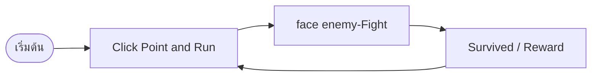

# [STRESSED] — Core Loop & Gameplay

## Core Loop

## Core Mechanics

1. [Mechanic หลักที่ 1 — อุปกรณ์ในการช่วยเหลือผู้เล่น]
2. [Mechanic หลักที่ 2 — การรักษาบาดแผล]

## Controls

| Key   | Action |
| ----- | ------ |
| wasd  | Move   |
| Space | Jump   |
| Mouse | Click  |

## Win / Lose Condition

- **ชนะเมื่อ:** Survived
- **แพ้เมื่อ:** Die
