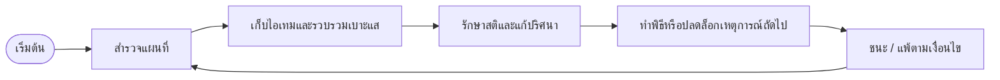

# STRESSED — Core Loop & Gameplay

## Core Loop

## Core Gameplay Loop

1. ผู้เล่นเลือกพื้นที่จากแผนที่เพื่อเข้าสู่ฉากใหม่
2. สำรวจจุดโต้ตอบต่าง ๆ และกดเพื่อซูมเข้าไปยังฉากย่อย
3. เก็บไอเทมและข้อมูลเพื่อปลดล็อกเหตุการณ์หรือปริศนา
4. ใช้ไฟฉายและความจำเป็นของสติเพื่อรับมือกับสิ่งที่ไม่ควรเห็น
5. ทำพิธีหรือปริศนาตามคำแนะนำ เพื่อหลุดออกจากมิติหรือเผชิญจุดจบที่ไม่คาดคิด

## Core Mechanics

1. **ไฟฉายตามเมาส์** — ไฟฉายจะเคลื่อนที่ตามตำแหน่งเมาส์เพื่อส่องความมืด
2. **ระบบแผนที่แบบเลือกพื้นที่** — ผู้เล่นไม่เดินอิสระ แต่เลือกจุดสำรวจจากแผนที่
3. **ระบบโต้ตอบกับฉาก** — คลิกวัตถุหรือจุดสำคัญเพื่อซูมเข้าและตรวจสอบชิ้นส่วนของฉาก
4. **ระบบเก็บไอเทม** — เก็บตัวอักษรโบราณ หนังสือ คัมภีร์ และไอเทมช่วยเหลือ
5. **ระบบสติ** — สติจะลดลงเมื่อเจอสัญญาณแปลก ๆ,  เมื่อเวลาผ่านไป และเพิ่มขึ้นเมื่อเก็บไอเทมบางชนิด
6. **ปริศนา/มินิเกม** — ใช้เพื่อร่ายคาถา หรือปลดล็อกเหตุการณ์สำคัญ

## Controls

| Action                                | Input                        |
| ------------------------------------- | ---------------------------- |
| เลือกพื้นที่/โต้ตอบ | Mouse Left Click             |
| เลื่อนไฟฉาย                | Mouse Movement               |
| ซูมเข้า/ออก                 | Click บนจุดโต้ตอบ |
| เริ่ม/หยุดเกม             | Esc                          |

## Win / Lose Condition

- **ชนะเมื่อ:** ทำพิธีถูกต้องครบและหนีออกจากมิติได้
- **แพ้เมื่อ:** สติหมดลง หรือทำพิธีผิดพลาดจนปลุกสิ่งลึกลับขึ้นมา
