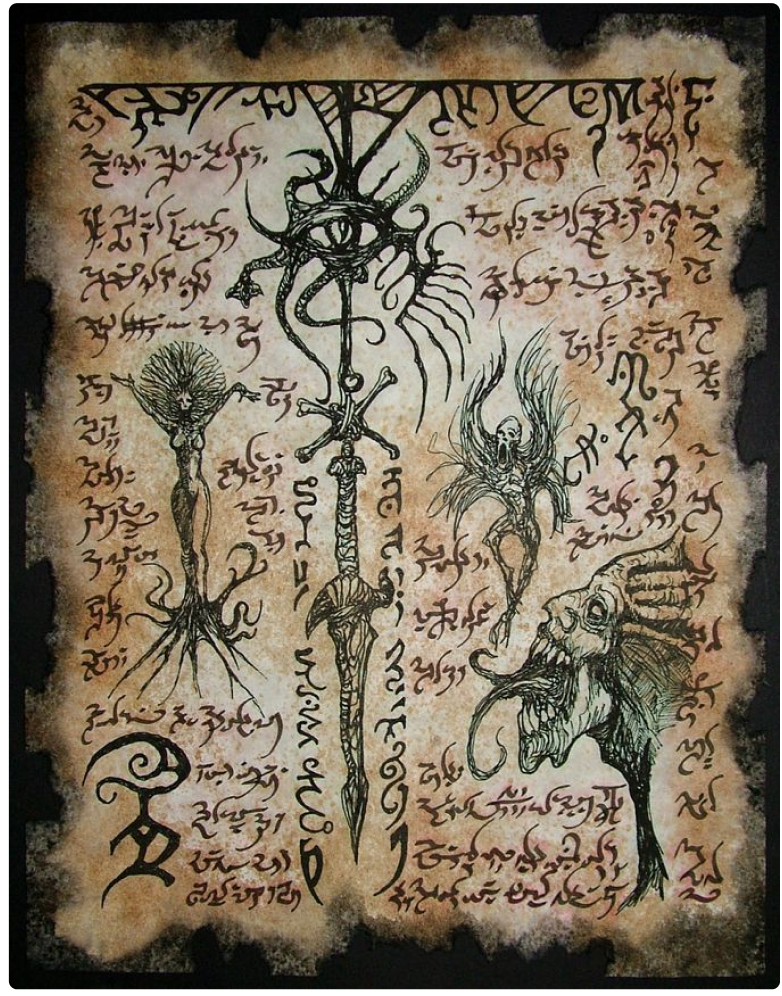

ภาพรวม

* Engine: MonoGame
* Genre: Point & Click, Horror, Puzzle
* Reference: Fears to Fathom, The House
* Game Jam: 24–27 กรกฎาคม 2026 
(22:00 น. วันที่ 24 – 02:50 น. วันที่ 27 → รวมประมาณ 52 ชั่วโมง ไม่ใช่ 2 วันเป๊ะ)
* Theme: Lovecraft
* Sub-theme: 
ความกดดันจากสิ่งที่ผู้เล่นไม่รู้ / ความกลัวผ่านความรู้สึกมากกว่าตัวผี / ไม่จำเป็นต้องมีผีเป็นตัวเป็นตน / ไม่สามารถระบุได้แน่ชัดว่าสิ่งตรงหน้าคืออะไร
* Jam Genre: ยังไม่เปิด รอวันเริ่มแจม
* ทีม: 4 คน ยังไม่แบ่ง หน้าที่

เนื้อเรื่อง (ยัง Draft อยู่)
ตัวละครหลักเป็นวัยรุ่นที่ตามหาความจริงของเรื่องราวลี้ลับที่เจอในโลกออน
ไลน์ เมื่อเข้าไปยังสถานที่ที่เกี่ยวข้อง กลับถูกดึงเข้าสู่มิติที่ไม่รู้จักทันที ต้องหาทางออกผ่านสถานที่ต่างๆ (ป่ารกร้าง, บ้าน ฯลฯ) โดยผสมตำนานปรัมปราและงานเขียนแนวเลิฟคราฟท์เข้ากับเหตุการณ์ที่เล่าแนวๆสมจริง เหมือนเรื่องเล่าต่างๆ (found-footage / analog horror)

* Core Mechanics
* ไฟฉายโทรศัพท์ขยับตามเมาส์ — ใช้สำรวจความมืด
* ระบบแผนที่: กดเลือกพื้นที่ ไม่มีการเดินอิสระ
* ระบบ interact กับจุดในฉาก → ซูมเข้าไปยังฉากย่อย (เช่น กดโต๊ะ → เข้าใกล้โต๊ะ)
* ระบบเก็บไอเทม (ตัวอักษรโบราณ, หนังสือ, คัมภีร์) → รวมไอเทมเพื่อปลดล็อกอีเวนต์
* มินิเกม/พัซเซิลสำหรับการร่ายคาถาหรือปลดล็อกไอเทม
* ระบบค่าสติ (ระบบหลัก)
* * ลด: ได้ยินเสียงแปลก, เจอสิ่งผิดปกติ, ไฟฉายส่องเจอสิ่งที่ไม่ควรเห็น, ลดตามเวลาไปเรื่อยๆ
  * เพิ่ม: เจอไอเทมบางชนิดที่ช่วยประคองสติ
  * แบ่งเป็น 3–4 stage แต่ละ stage เปลี่ยน art style แบบหน้ามือหลังมือ และเพิ่มโอกาสเจอเหตุการณ์หลอน
  * สติหมด = แพ้ทันที
* Win condition: ทำพิธีถูกต้องครบ → หลุดออกจากมิติ / ทำพิธีผิด → ปลุกบางอย่างขึ้นมาแทนที่จะได้ออกไป

Core Loop
สำรวจแมพ → เจอไอเทม → ประคองสติ → ทำ puzzle/มินิเกม → ได้ไอเทม → ได้เบาะแสไอเทมถัดไป → รวมไอเทม → ทำพิธี → วนจนพิธีครบ → จบเกม (ชนะ/แพ้ตามเงื่อนไข)

วันแรกตอนเริ่ม 24 ก.ค. 22:00–24:00 (~2 ชม.)

* ดู Jam Genre ที่ประกาศในวันจริงแล้วมาคุยก่อน ปรับ concept ให้ตรงกับ genre ที่ได้
* Finalize เนื้อเรื่องเวอร์ชันสั้นที่สุดที่ยังเล่าเรื่องครบ
* แบ่ง role ทีม: อย่างน้อยต้องมีคนรับผิดชอบโค้ดเป็นลีดโค้ด, ลีดอาร์ต, ที่เหลือ flex ตาม workload
* ล็อก scope งาน(ดูหัวข้อ "สิ่งที่ควรตัด" ข้างล่าง) จะได้ดูว่าควรทำอะไรก่อน

วันที่ 2 25 ก.ค. 24 ชม
โฟกัส core systems ก่อน:

* ไฟฉายตามเมาส์ + overlay ความมืด
* ระบบแผนที่ (กดเลือกพื้นที่)
* ระบบ interact กับจุดในฉาก + ซูมเข้าฉากย่อย
* ระบบเก็บไอเทมพื้นฐาน

เป้าหมายวันนี้คือได้ prototype การเดินการเปลี่ยนฉาก การเก็บไอเทม การฉายไฟฉาย ทำเป็น placeholder ไว้ก่อนค่อยเอาอาร์ตมาแปะ
วันที่ 3 26 ก.ค. 24 ชม

* ใส่ระบบค่าสติ + สลับ art stage (เริ่มจาก 2 stage ให้ทำงานได้ก่อน เวลาเหลือค่อยไปเพิ่ม stage 3 เดี๋ยวไม่ทัน)
* ใส่ mini-game/puzzle อย่างน้อย 1 แบบที่ เอาไป reuse ได้หลายจุด
* ระบบรวมไอเทม trigger event
* เริ่มใส่ art จริงแทน placeholder เอาเท่าที่ทัน
* ช่วงเย็นไม่ก็ค่ำๆ: เชื่อมทุกระบบเข้าด้วยกันเป็น build เดียวที่พอเล่นจบได้ (ตรงนี้คือมีอย่างน้อย 1 ending)

เช้าสุดท้าย 27 ก.ค. 00:00–02:50

* Bug fix เท่านั้น ห้ามเพิ่มฟีเจอร์ใหม่
* ใส่เสียง/SFX หาเอาตามเว็บถ้ามีเวลาเหลือ
* Build/export ไฟล์สำหรับส่ง + ลองรัน ว่ารันได้ไหม
* เตรียม submission ในแจมประมาณ 30นาที เพราะต้องไปสร้างหน้าเว็บในแจม

อะไรควรตัดก่อนถ้าเวลาไม่พอ

1. Sanity stage เหลือ 2 stage แทน 3–4
2. Mini-game เหลือแบบเดียว ใช้ซ้ำทุกจุดที่ต้องร่ายคาถาหรือเกิด event
3. จำนวนพื้นที่ (map) เหลือ 1–2 ที่พอ
4. Ending เหลือแค่ชนะ แพ้ อย่างละแบบพอ ค่าสติหมดตาย ทำครบรอด
5. Art transition ระหว่าง stage ทำแบบเปลี่ยนสี/ใส่filter ง่ายๆแทนพอ ใน monogame น่าจะทำได้เรื่องการบิดภาพเหมือนใน unity
