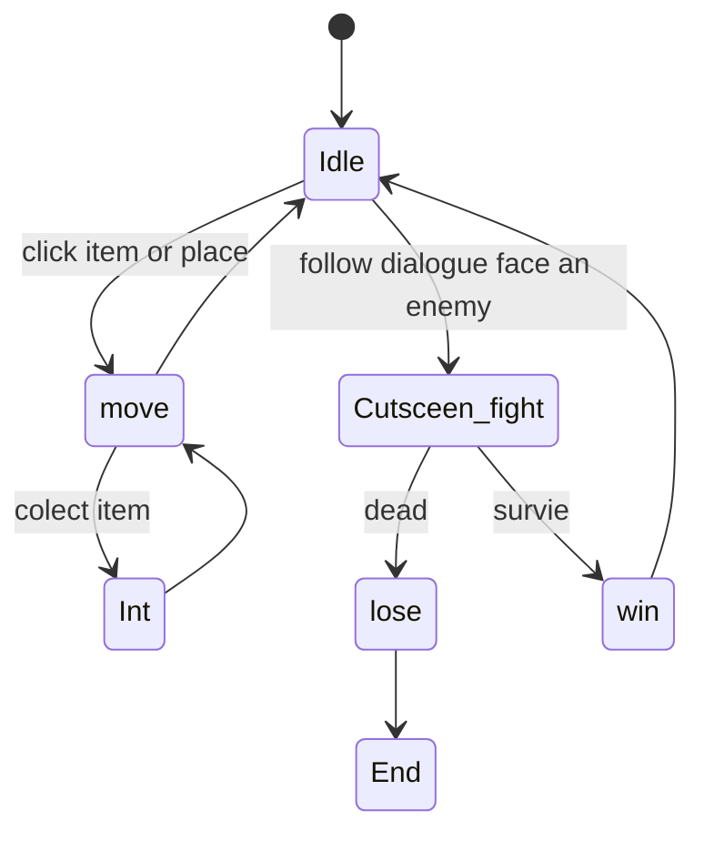

# Mechanic Design — [ชื่อ Mechanic]

## State Diagram

## Rules

| State    | เข้าเงื่อนไข                            | ออกเงื่อนไข                             | Note               |
| -------- | --------------------------------------------------- | -------------------------------------------------- | ------------------ |
| Idle     | เมื่อตัวละครอยู่นิ่ง            | เมื่อมีการเคลื่อนไหว           | Animation loop     |
| Move     | กดไปตามพื้นที่                        | เมื่อตัวละครหยุดนิ่ง           | Speed              |
| Int      | กดไปที่ไอเทม                            | เมื่อไม่มีการคลิกที่ไอเทม | Interact with item |
| Cutsceen | เมื่อenemyเข้าในระยะที่กำหนด | เมื่อไม่อยู่ในระยะ               | Quick time event   |
| lose     | เมื่อแพ้ในcutsceen                        | เมื่อชนะcutsceen                           | lose               |
| End      | เมื่อชนะcutsceen                            | เมื่อแพ้ในcutsceen                       | Renew game         |
