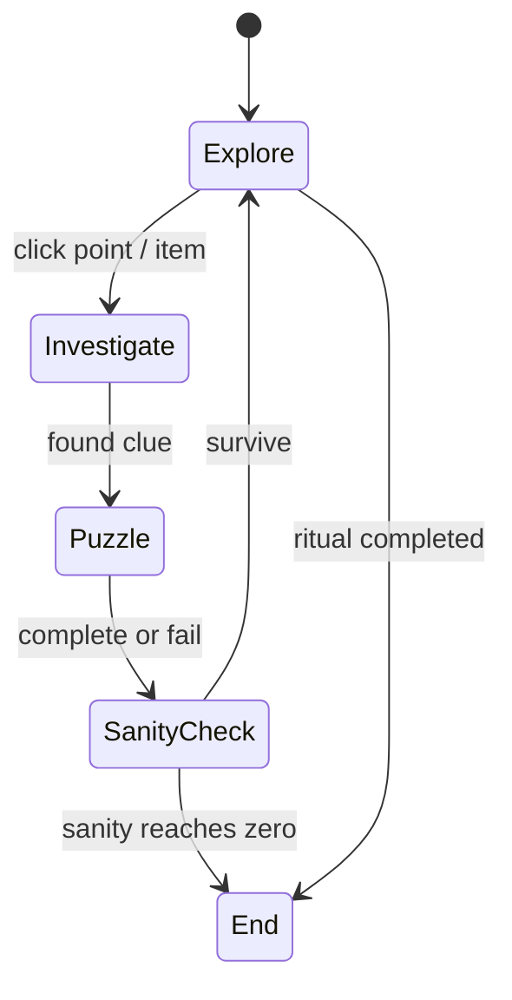

# Mechanic Design — Sanity & Investigation

## State Diagram

## Rules
| State | เข้าเงื่อนไข | ออกเงื่อนไข | Note |
| --- | --- | --- | --- |
| Explore | ผู้เล่นเลือกพื้นที่หรือสำรวจจุดในฉาก | เมื่อเข้าสู่โหมดตรวจสอบ | ใช้ไฟฉายและการคลิกเพื่อค้นหา |
| Investigate | คลิกวัตถุหรือจุดสำคัญในฉาก | เมื่อผู้เล่นปิดการตรวจสอบหรือเลิกโต้ตอบ | ซูมเข้าและแสดงข้อมูล/ไอเทม |
| Puzzle | เจอปริศนา/มินิเกมที่ต้องแก้ | เมื่อทำสำเร็จหรือล้มเหลว | ใช้เพื่อปลดล็อกเหตุการณ์หรือไอเทม |
| SanityCheck | เหตุการณ์แปลก ๆ เกิดขึ้นหรือสติลดลง | เมื่อสติกลับมาเป็นปกติหรือหมดลง | ควบคุมความรู้สึกกดดันของเกม |
| End | ทำพิธีสำเร็จหรือสติหมด | เมื่อเกมจบ | แสดงผลลัพธ์ชนะ/แพ้ |

## Core Systems Detail
- **Investigation:** คลิกวัตถุในฉากเพื่อสืบค้นข้อมูลและเก็บไอเทม
- **Sanity:** สติจะลดลงเมื่อเจอเสียงแปลก ๆ, เห็นสิ่งผิดปกติ หรืออยู่ในพื้นที่มืดนาน ๆ
- **Ritual:** ผู้เล่นจะต้องรวมไอเทมและทำพิธีให้ถูกต้องตามคำแนะนำจากเบาะแสที่พบ
