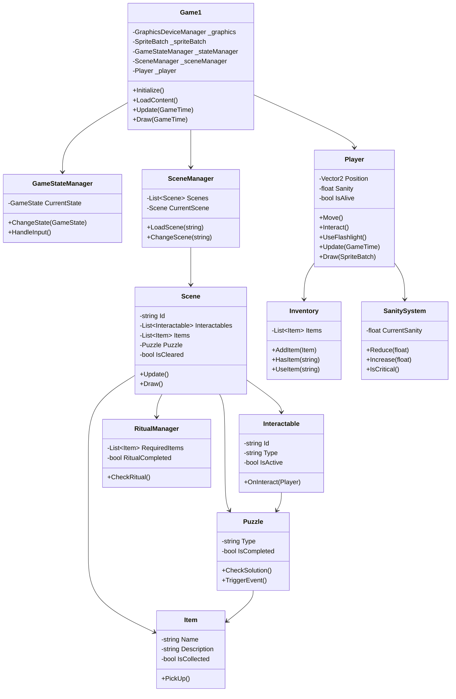

# Class Diagram — STRESSED

```mermaid
classDiagram
    class Game1 {
        -GraphicsDeviceManager _graphics
        -SpriteBatch _spriteBatch
        -GameStateManager _stateManager
        -SceneManager _sceneManager
        -Player _player
        +Initialize()
        +LoadContent()
        +Update(GameTime)
        +Draw(GameTime)
    }

    class GameStateManager {
        -GameState CurrentState
        +ChangeState(GameState)
        +HandleInput()
    }

    class SceneManager {
        -List~Scene~ Scenes
        -Scene CurrentScene
        +LoadScene(string)
        +ChangeScene(string)
    }

    class Scene {
        -string Id
        -List~Interactable~ Interactables
        -List~Item~ Items
        -Puzzle Puzzle
        -bool IsCleared
        +Update()
        +Draw()
    }

    class Player {
        -Vector2 Position
        -float Sanity
        -bool IsAlive
        +Move()
        +Interact()
        +UseFlashlight()
        +Update(GameTime)
        +Draw(SpriteBatch)
    }

    class Inventory {
        -List~Item~ Items
        +AddItem(Item)
        +HasItem(string)
        +UseItem(string)
    }

    class SanitySystem {
        -float CurrentSanity
        +Reduce(float)
        +Increase(float)
        +IsCritical()
    }

    class Interactable {
        -string Id
        -string Type
        -bool IsActive
        +OnInteract(Player)
    }

    class Item {
        -string Name
        -string Description
        -bool IsCollected
        +PickUp()
    }

    class Puzzle {
        -string Type
        -bool IsCompleted
        +CheckSolution()
        +TriggerEvent()
    }

    class RitualManager {
        -List~Item~ RequiredItems
        -bool RitualCompleted
        +CheckRitual()
    }

    Game1 --> GameStateManager
    Game1 --> SceneManager
    Game1 --> Player
    SceneManager --> Scene
    Scene --> Interactable
    Scene --> Item
    Scene --> Puzzle
    Scene --> RitualManager
    Player --> Inventory
    Player --> SanitySystem
    Interactable --> Puzzle
    Puzzle --> Item
```
