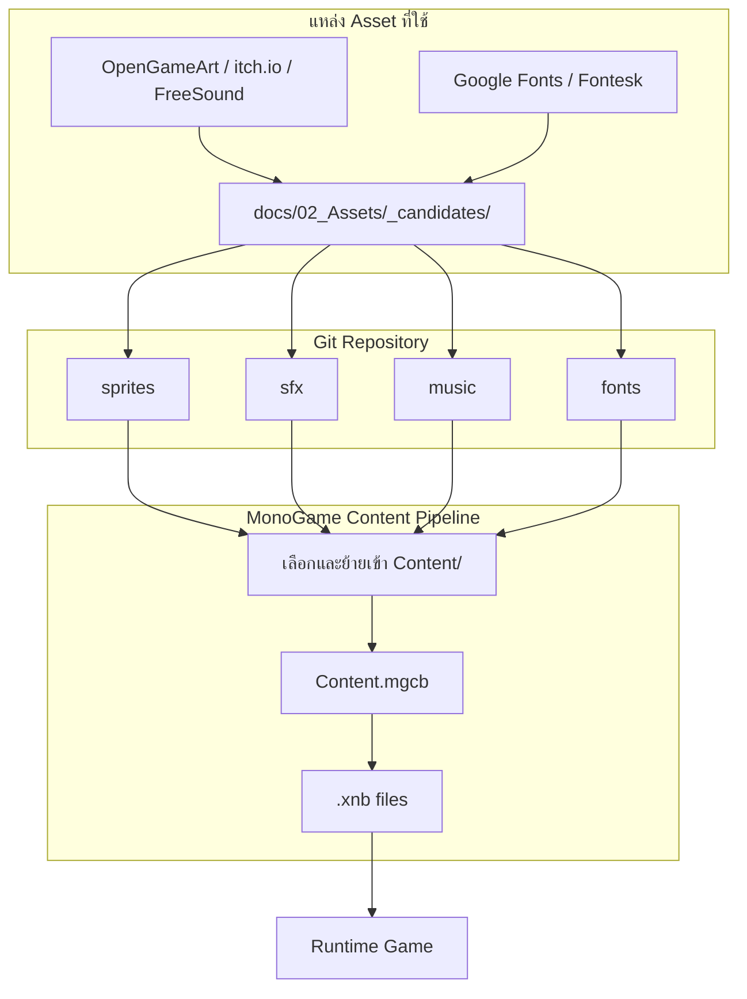

## Asset Pipeline Flow

## แนวทางการจัดการ Asset
- ใช้สไตล์ภาพที่เรียบง่ายแต่สร้างบรรยากาศได้ดี
- เสียงและเอฟเฟกต์ต้องช่วยเพิ่มความรู้สึกกดดันและความไม่ปลอดภัย
- ควรมี asset ที่สามารถ reuse ได้ในหลายฉากเพื่อประหยัดเวลา
