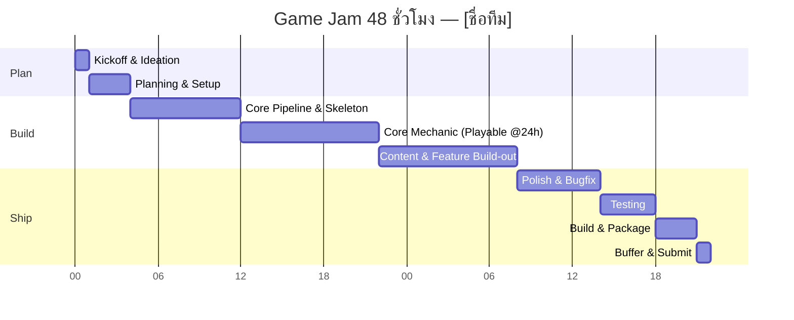

# 48-Hour Timeline — [ชื่อทีม]

| หัวข้อ                                          | รายละเอียด       |
| ----------------------------------------------------- | -------------------------- |
| Time Keeper                                           | ทุกคน                 |
| Jam เริ่มจริง (วันที่ศุกร์ที่) | ศ. 24 ก.ค. 2569 12:59   |
| Deadline ส่งงาน (วัน-เวลา)               | อา. 26 ก.ค. 2569 12:00 |
| Jam จบ                                              | อา. 26 ก.ค. 2569 12:59 |

> คำนวณ "เวลาจริง" ของแต่ละ Phase จาก **เวลาที่ Jam เริ่มจริง** ด้านบน แล้วเติมในคอลัมน์ขวาสุด — ใช้ตารางนี้เป็นจุดอ้างอิงเดียวของทีมตลอด 48 ชม.

| Phase                                       | ช่วง (hr) | เวลาจริง (0, 1, 2, ... 48) | เป้าหมาย / Deliverable                                                                   | สถานะ | เวลาจริงที่เสร็จ |
| ------------------------------------------- | ------------- | ---------------------------------- | ------------------------------------------------------------------------------------------------ | ---------- | -------------------------------- |
| 0. Kickoff & Ideation                       | 0–3          | 0–3                               | รู้ theme, brainstorm, ล็อกคอนเซปต์ + core loop 1 บรรทัด                    | 🔲         |                                  |
| 1. Planning & Setup                         | 3–6          | 3–6                               | GDD one-pager, ตกลง pipeline, ตั้ง repo, แบ่งงาน                                  | 🔲         |                                  |
| 2. Core Pipeline & Skeleton                 | 6–14         | 6–14                              | Game loop โครงหลักรันได้ (state, input, render ว่างเปล่า)                 | 🔲         |                                  |
| 3. Core Mechanic                            | 14–24        | 14–24                             | กลไกหลักเล่นได้จริง 1 อย่าง —**Playable Build Checkpoint**        | 🔲         |                                  |
| 4. Content & Feature Build-out              | 24–34        | 24–34                             | ด่าน/เนื้อหา, UI/HUD, เสียง, กลไกรอง                                      | 🔲         |                                  |
| 5. 🔒 Feature Freeze                        | ที่ 34     | 34                                 | **ห้ามเพิ่ม feature ใหม่หลังจุดนี้** ทุกคน merge เข้า main | 🔲         |                                  |
| 6. Polish & Bugfix                          | 34–40        | 34–40                             | แก้บั๊ก, ปรับ balance, juice/feedback เล็กๆ                                      | 🔲         |                                  |
| 7. Testing (คนนอกทีมลองเล่น) | 40–44        | 40–44                             | playtest, จด bug ที่เหลือ, แก้เฉพาะตัวที่ critical                       | 🔲         |                                  |
| 8. Build & Package                          | 44–47        | 44–47                             | สร้าง build จริง, ทดสอบบนเครื่องอื่น, เตรียมหน้า submission | 🔲         |                                  |
| 9. Buffer & Submit                          | 47–48        | 47–48                             | เผื่อเวลาหน้างาน, ส่งงานก่อนเวลาอย่างน้อย 15 นาที     | 🔲         |                                  |

## กติกา Checkpoint

- ถ้าถึงเวลาใน Phase ใดแล้วยังไม่เสร็จ → **Time Keeper** เรียกประชุมด่วน (ไม่เกิน 5 นาที) เพื่อตัด scope ทันที ตาม cut-list ใน [01-pipeline-checklist.md](01-pipeline-checklist.md)
- ห้ามปล่อยให้ Phase ที่ล่าช้าลากยาวไปกระทบ Phase ถัดไปเกิน [1 ชม.]
- อัปเดตคอลัมน์ "สถานะ" และ "เวลาจริงที่เสร็จ" ทุกครั้งที่ปิด Phase เพื่อให้ทั้งทีมเห็นความคืบหน้าตรงกัน
