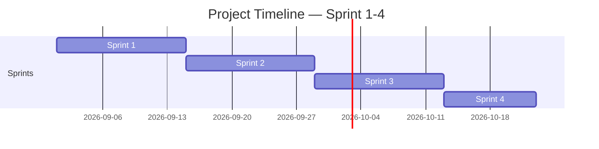

<!-- Template เต็มไฟล์สำหรับสร้าง docs/agile/02-sprint-backlog.md -->

<!-- ภาพรวมว่า Story ไหนไปอยู่ Sprint ไหนตลอด 4 Sprint — ไม่ต้องระบุคนรับผิดชอบ/Status ที่นี่ ส่วนนั้นอยู่ใน sprint-plan-[NN].md ของ Sprint ที่กำลังทำ -->

# Sprint Backlog

**Version:** 1.0 | **Last Updated:** 2026-09-01

> ภาพรวมว่า User Story ไหนจาก `01-product-backlog.md` จะไปอยู่ Sprint ไหน — Sprint ที่ยังไม่ถึงคือ draft คร่าวๆ ปรับได้เสมอเมื่อเข้าใจงานมากขึ้น

## Timeline (4 Sprint, Sprint ละ 2 สัปดาห์)

| Sprint     | เริ่ม | สิ้นสุด |
| ---------- | ---------- | -------------- |
| Sprint 1-2 | 2026-09-18 | 2026-09-26     |
| Sprint 3   | 2026-09-29 | 2026-10-12     |
| Sprint 4   | 2026-10-13 | 2026-10-15     |

> ปรับวันที่ให้ตรงกับวันที่ทีมเริ่มลงมือทำจริง (ถ้าไม่ใช่วันแลปนี้)

## Sprint 1-2 (กำลังทำ)

| #            | User Story                                                                                   | MoSCoW                 | Estimate (SP) |
| ------------ | -------------------------------------------------------------------------------------------- | ---------------------- | ------------- |
| **1**  | **As designer, ไม่เอาผีโผล่ออกมาแบบแปะภาพ**                  | **Must Have**    | 8             |
| **2**  | **As designer, เอาระบบปืนออก**                                           | **Must Have**    | **5**   |
| **3**  | **As designer, ผีอยู่รอบๆตัว ต้องเอาไฟฉายส่องถึงไป** | **Must Have**    | **6**   |
| **4**  | **As a player, มีคัตซีนตอนเปลี่ยนที่**                            | **Must Have**    | **5**   |
| **5**  | **As Development, ให้ไฟฉายมีความสั่น**                               | **Should Have**  | **4**   |
| **6**  | **As Designer, เพิ่มให้ทางให้ยาวขึ้น**                            | **Should Have**  | **6**   |
| **7**  | **As player, อยากให้มีประเภทผีเพิ่มขึ้น**                    | **Should Have**  | **6**   |
| **8**  | **As designer, ทำให้puzzle ซับซ้อนขึ้น**                              | **Should Have**  | **7**   |
| **9**  | **As Developmentไฟฉายกระพริบ**                                             | **Nice to Have** | **5**   |
| **10** | **As Artist, ไฟฉายสวยขึ้น**                                                | **Nice to Have** | **5**   |
| **11**      | **As Artist, ทำฉากเกมใหม่**                                                     | **Must Have**         | **10**       |

## Sprint 3 (Draft)

| # | User Story                                                                                                                                                                                                                                                                                                      | MoSCoW       | Estimate (SP) |
| - | --------------------------------------------------------------------------------------------------------------------------------------------------------------------------------------------------------------------------------------------------------------------------------------------------------------- | ------------ | ------------- |
| 1 | As Artist, คัตซีนตอนเปลี่ยนด่าน เช่น เปิดประตู เดินเข้าป่า                                                                                                                                                                                                          | Must Have    | 5             |
| 2 | As Development, เพิ่มปุ่มเริ่มเล่นใหม่ได้                                                                                                                                                                                                                                              | Must Have    | 5             |
| 3 | As designer, เพิ่มเอฟเฟกต์ตอนผีหายตัว                                                                                                                                                                                                                                                   | Must Have    | 8             |
| 4 | As desingner ,เพิ่มเสียงให้สมจริง                                                                                                                                                                                                                                                            | Must Have    | 8             |
| 5 | As Artist, เพิ่มหนวดหมึกขอบจอตามค่า sanity                                                                                                                                                                                                                                              | Must Have    | 10            |
| 6 | As player, เพิ่มวิธีเล่น                                                                                                                                                                                                                                                                           | Should Have  | 5             |
| 7 | AS Development, เพิ่มตัวเลือกระดับความยาก-ง่ายของเกมผู้เล่นสามารถเลือกระดับความยากก่อนเริ่มเกม และแต่ละระดับต้องส่งผลต่อ Gameplay เช่น ความยากของ Puzzle หรือพฤติกรรมของผี | Nice to Have | 6             |
| 8 | As Designer ใส easter eggของเกมอื่น                                                                                                                                                                                                                                                                | Nice to Have | 3             |
| 9 | As Development, เพิ่มสถิติเวลาที่ผู้เล่นเล่นเกมจบ จัดอันดับเวลาที่ไวที่สุด                                                                                                                                                                            | Nice to Have | 3             |

## Sprint 4 (ตรวจงาน)

| # | User Story           | MoSCoW    | Estimate (SP) |
| - | -------------------- | --------- | ------------- |
| 1 | As a Team ทำGDD    | Must Have | 8             |
| 2 | As a Team หาบัค | Must Have | 8             |
| 3 |                      |           |               |

> **Sprint 2-4 คือ draft ระดับ release plan** — เป้าหมายคือฝึกกะจำนวน SP ต่อ Sprint ให้ใกล้เคียง capacity ของทีม ไม่ใช่ล็อก scope ตายตัว ปรับได้ทุกครั้งที่ทำ Sprint Planning ของ Sprint ถัดไป
>
> เมื่อ Sprint ไหนเริ่มทำงานจริง ให้คัดลอก template `sprint-plan-template.md` (ไฟล์แนบใน LMS) ไปสร้าง `docs/agile/sprint-plan-[NN].md` แล้วดึง Story ของ Sprint นั้นจากตารางด้านบนมาใส่คนรับผิดชอบ แตก Task และปรับ Estimate ให้ละเอียดขึ้น

## Links

- [[docs/agile/01-product-backlog|Product Backlog]]
- [[docs/agile/sprint-plan-01|Sprint 1 Plan]]
