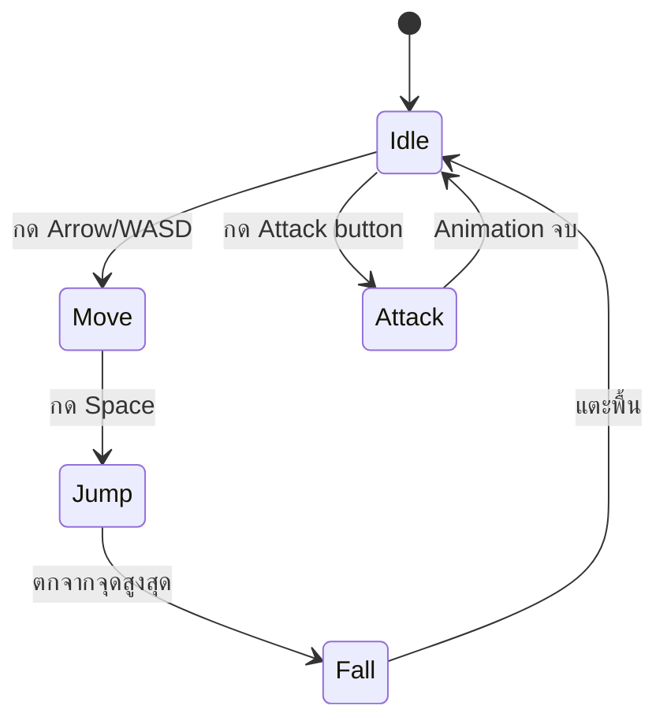

# Mechanic Design — [ชื่อ Mechanic]

## State Diagram

## Rules

| State | เข้าเงื่อนไข | ออกเงื่อนไข | Note |
|---|---|---|---|
| Idle | เริ่มเกม / หยุดเคลื่อนที่ | กด input ใดๆ | Animation loop |
| Move | กดปุ่มทิศทาง | ปล่อยปุ่ม / กระโดด | Speed = [ค่า] |
| Jump | กด Space ขณะอยู่พื้น | ถึงจุดสูงสุด | Gravity = [ค่า] |
